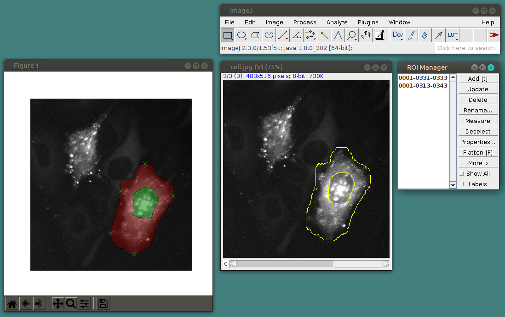

# PyImageJ-DEXTR

This package uses Deep Extreme Cut ([DEXTR](https://github.com/scaelles/DEXTR-PyTorch)) to generate ImageJ ROIs via PyImageJ.

# Installation requirements

  - python >= 3.6
  - pyimagej
  - openjdk=8
  - opencv
  - pytorch
  - torchvision
  - cpuonly (_optional_ if no CUDA cores are available)